

# MANUAL DE USO

> Manual de uso para el aplicativo de retail virtual orientado al aprendizaje de conceptos claves sobre un punto de venta

Universidad de Lima - Marzo de 2023

## TABLA DE CONTENIDOS

&nbsp;&nbsp;&nbsp;&nbsp;[**1. Propósito**](#prop)

&nbsp;&nbsp;&nbsp;&nbsp;[**2. Alcance**](#alc)

&nbsp;&nbsp;&nbsp;&nbsp;[**3. Descripción**](#desc)

&nbsp;&nbsp;&nbsp;&nbsp;&nbsp;&nbsp;[3.1 Controles](#cont)

&nbsp;&nbsp;&nbsp;&nbsp;&nbsp;&nbsp;[3.2 Descripción del ambiente](#amb)
 
 

##  1. Propósito
El propósito de este documento es dar a conocer a los usuarios finales, las características, funcionalidades y uso del aplicativo Retail Virtual para el aprendizaje de conceptos claves sobre un punto de venta.

 

##  2. Alcance
Las principales funcionalidades consideradas como parte del alcance de este aplicativo son las siguientes:

1. Acción de desplazarse, agacharse y enfocar la vista dentro del ambiente virtual.
2. Interacción con entidades dentro del ambiente virtual.
3. Configuración manual del volumen del aplicativo
4.  Visualizar el mapa y acceder a puntos definidos en entorno virtual.

 

##  3. Descripción
El aplicativo Retail Virtual es una herramienta diseñada para facilitar el aprendizaje de los conceptos claves relacionados con un punto de venta. Esta aplicación ofrece una experiencia interactiva y realista que permite a los usuarios explorar un entorno virtual que simula un punto de venta y aprender sobre las diferentes estrategias y técnicas utilizadas en el retail. Para acceder al aplicativo, primero debemos ingresar el enlace <https://unity-rv-dcc4a.web.app/HostRV/> en el navegador web.

 

##  3.1 Controles
**Menú pausa:** al presionar la tecla P o Esc, se accede al menú de pausa.

**Zoom:** al presionar la tecla Ctrl se realizará un acercamiento o zoom a la cámara del jugador.

**Agacharse:** al presionar la tecla Espacio, el personaje del jugador se agacha.

 

## 3.2  Descripción del ambiente
Una vez que la página se haya cargado completamente, aparecerá un mensaje de bienvenida con un botón en el centro (“Empezar”) que nos permitirá acceder a la experiencia.

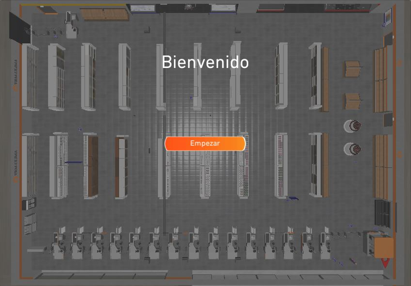
 

Mejora sugerida: Una vez que se hace clic en el botón "Empezar", el usuario se encontrará con un personaje ubicado en la puerta del establecimiento con el que puede interactuar. Al hacer clic en él, el personaje proporcionará una breve explicación sobre el propósito de la aplicación y las actividades disponibles para experimentar. Además, ofrecerá información fundamental para contextualizar al usuario, proporcionando algunos conceptos clave.

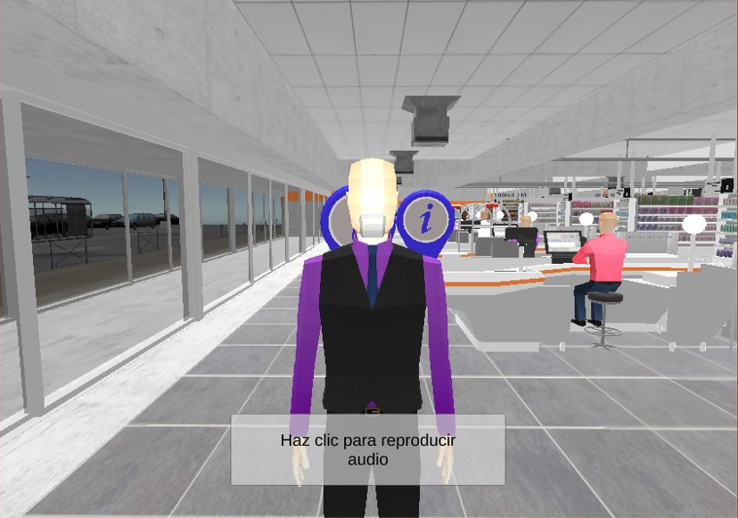
 

A lo largo del establecimiento se encuentran diferentes puntos de interés que se identifican mediante globos azules que contienen una “*i*” en el centro.

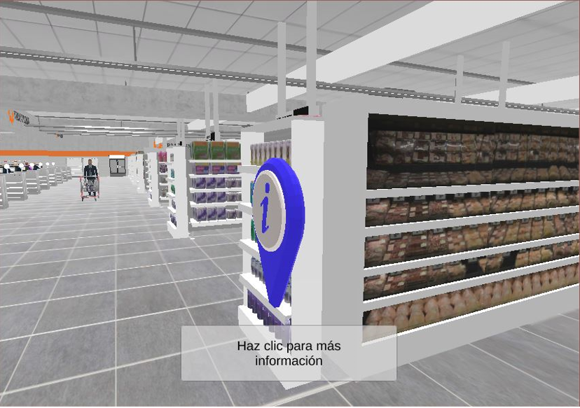
 

Al hacer clic en uno de estos globos, se desplegará un panel con información sobre los diferentes conceptos que se buscan reforzar en este recorrido virtual.

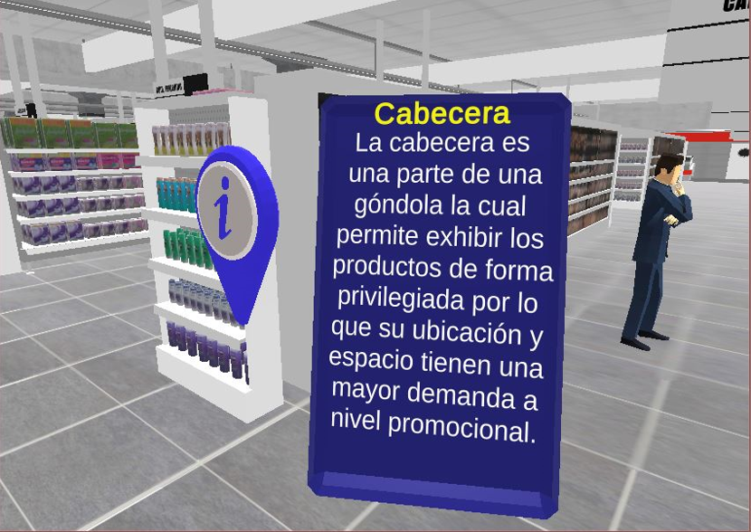
 

De la misma manera, dentro del entorno virtual podemos encontrar más puntos interactivos, los cuales se detallan a continuación.

|||
|-|-|
|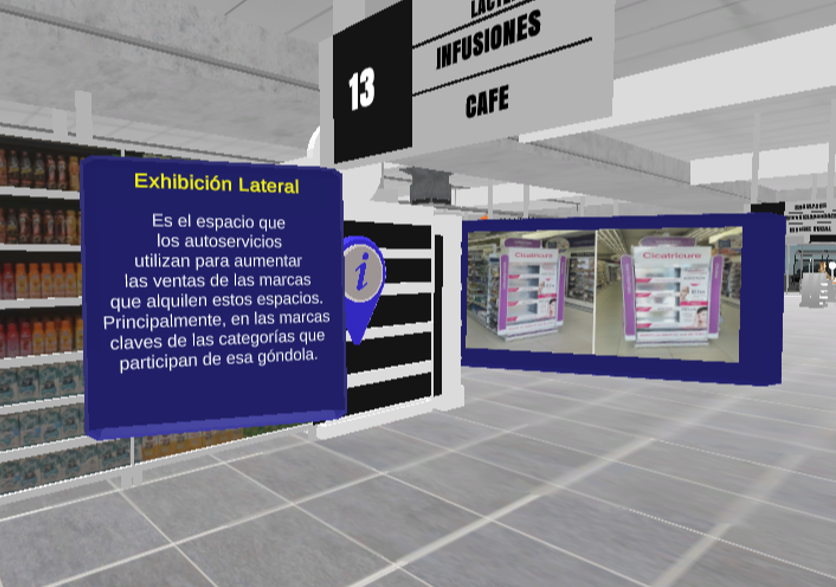|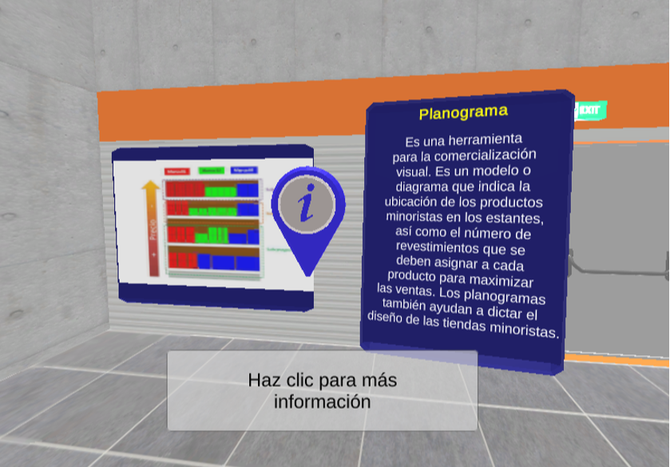|
|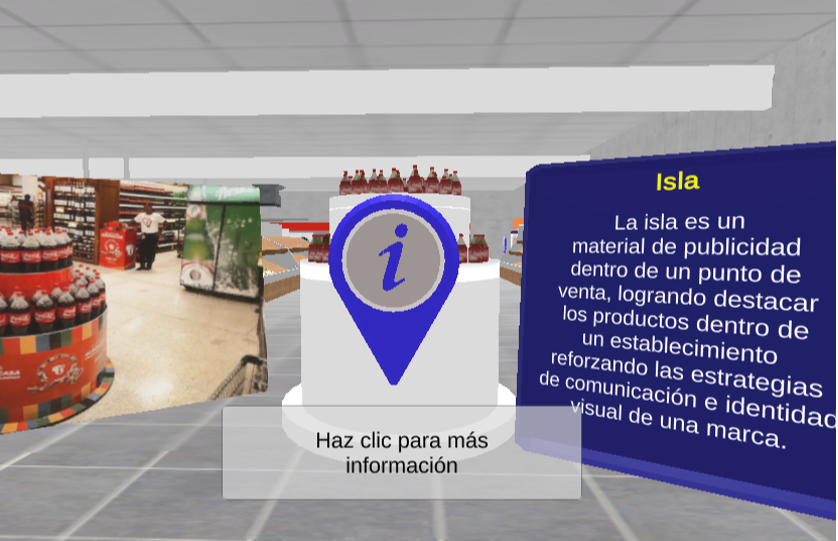|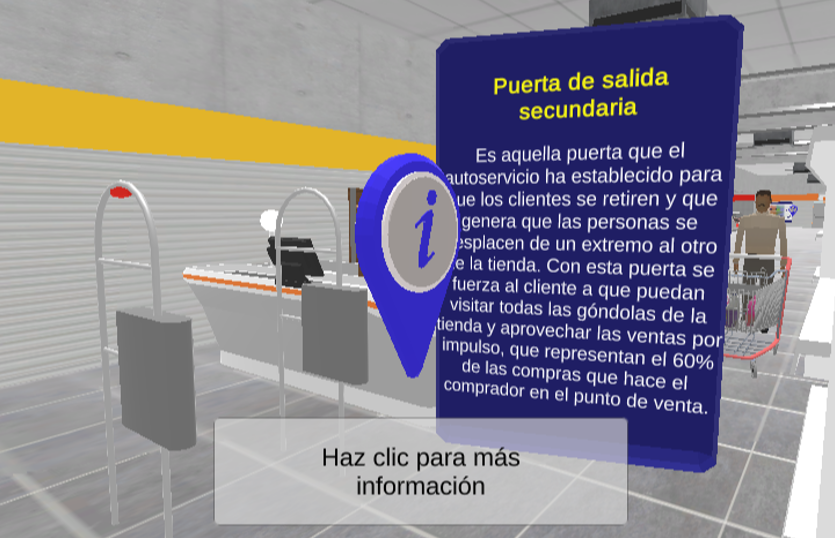|
|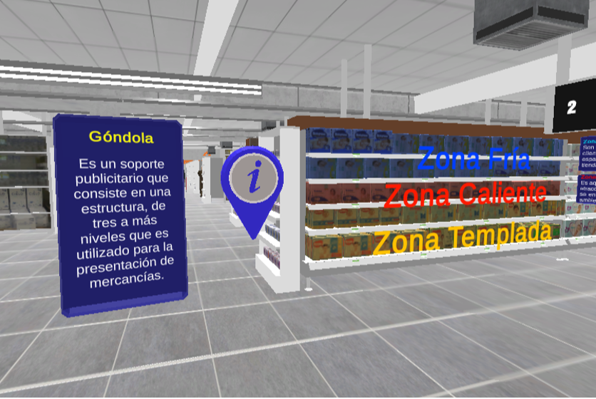|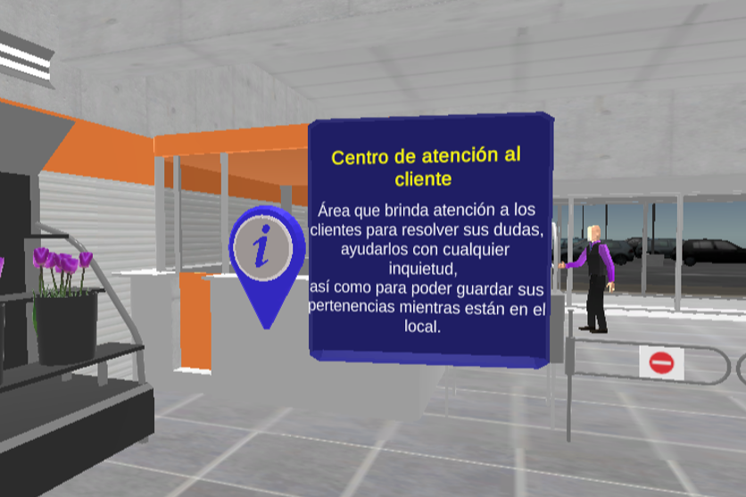|
|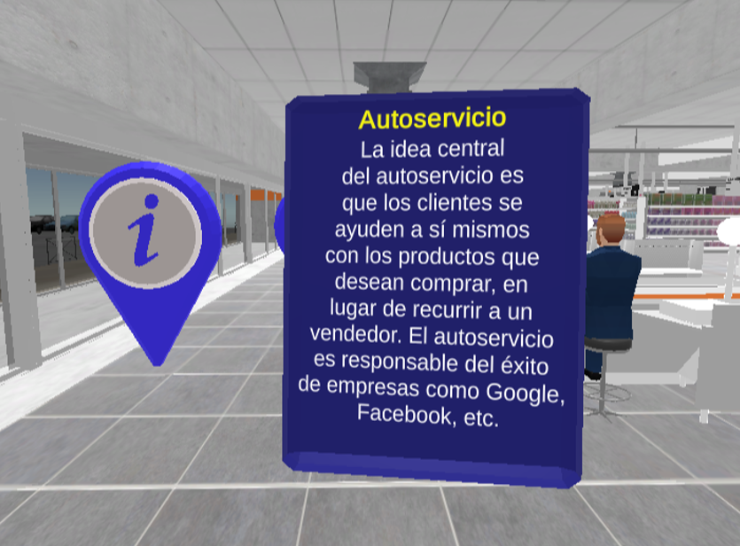|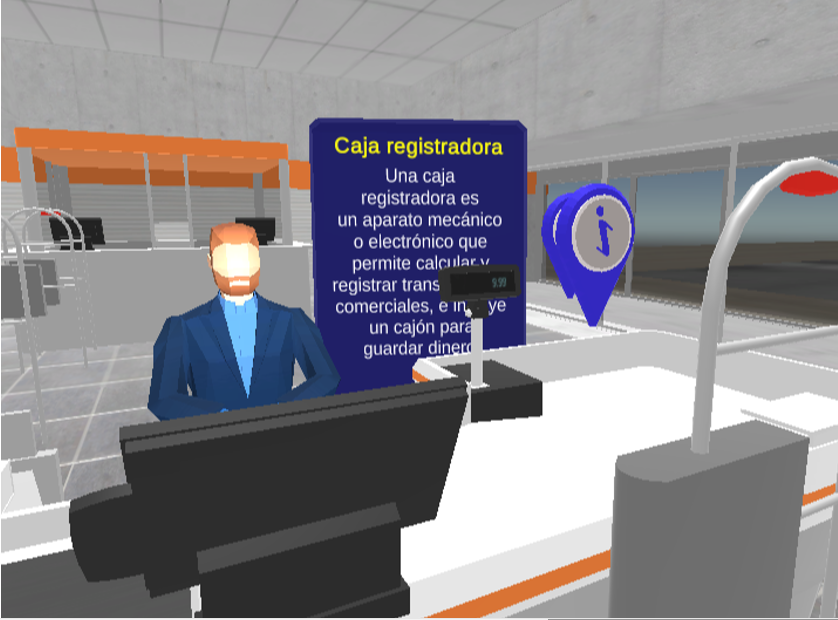|
|||

Al presionar la tecla "Esc" o la tecla “P”, se abrirá automáticamente un menú con dos funciones. Se encontrará tanto el botón “Ver Mapa” y “Opciones” para personalizar la experiencia del usuario.

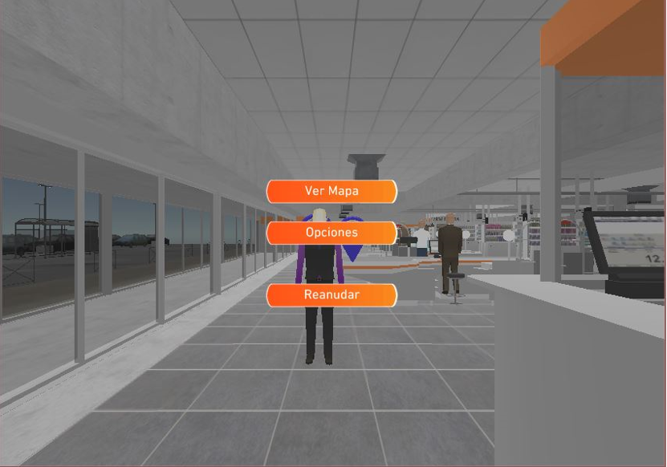
 

En lo que respecta a las opciones del usuario, estas permiten modular la intensidad con las que se van a reproducir las voces que brindan información y los sonidos característicos de estos establecimientos. Además, también permite aumentar o disminuir el volumen de la música ambiental con la que se cuenta.

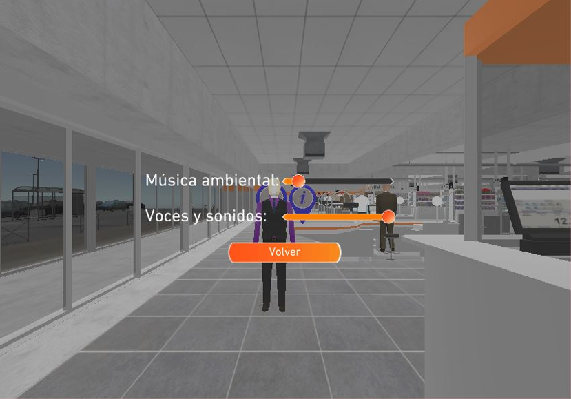
 

Por parte del mapa del Retail Virtual, mostrará la posición del usuario representada por un ícono de ubicación rojo. Además, el croquis señalará las categorías de cada pasillo y al dar click en una de ellas, el jugador automáticamente aparecerá en aquella ubicación.

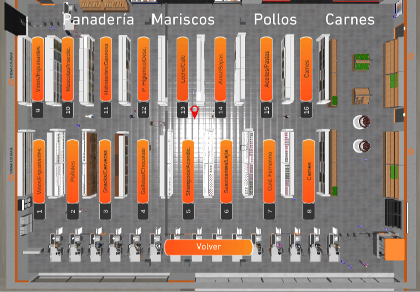
 
